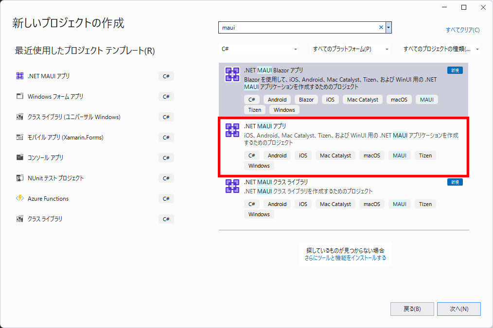
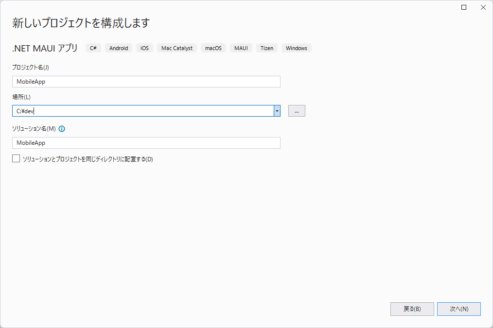

# 目次

- [目次](#目次)
- [.NET MAUI hands on lab](#net-maui-hands-on-lab)
  - [システム要件](#システム要件)
  - [Visual Studio 2022 のインストール](#visual-studio-2022-のインストール)
  - [ワークロードのインストール](#ワークロードのインストール)
  - [.NET MAUI アプリの作成と動作確認](#net-maui-アプリの作成と動作確認)
    - [最初の起動](#最初の起動)
      - [Android エミュレーターの作成](#android-エミュレーターの作成)
      - [デバッグ実行](#デバッグ実行)
    - [デフォルトプロジェクトの構成](#デフォルトプロジェクトの構成)
      - [`MauiProgram.cs`](#mauiprogramcs)
      - [`App.xaml.cs`](#appxamlcs)
      - [`AppShell.xaml`](#appshellxaml)
      - [`AppShell.xaml.cs`](#appshellxamlcs)
      - [`MainPage.xaml`](#mainpagexaml)
      - [`MainPage.xaml.cs`](#mainpagexamlcs)
  - [Web API への接続](#web-api-への接続)
    - [モデルクラスの作成](#モデルクラスの作成)
    - [View の作成](#view-の作成)
    - [コードビハインドにコードを追加](#コードビハインドにコードを追加)
    - [デバッグ実行](#デバッグ実行-1)
    - [Web API への接続に書き換え](#web-api-への接続に書き換え)
  - [.NET MAUI アプリへのComunityToolkit.Mvvmの適用と動作確認](#net-maui-アプリへのcomunitytoolkitmvvmの適用と動作確認)
    - [最初の起動](#最初の起動-1)
      - [Android エミュレーターの作成](#android-エミュレーターの作成-1)
      - [デバッグ実行](#デバッグ実行-2)
    - [CommunityToolkit.Mvvm NuGetパッケージのインストール](#communitytoolkitmvvm-nugetパッケージのインストール)
    - [フォルダ構成の変更](#フォルダ構成の変更)
      - [デフォルトプロジェクトの構成](#デフォルトプロジェクトの構成-1)
      - [MVVMの各フォルダを作成](#mvvmの各フォルダを作成)
      - [MainPageファイルの移動](#mainpageファイルの移動)
    - [ViewModelの追加](#viewmodelの追加)
      - [ViewModelBase.csの追加](#viewmodelbasecsの追加)
      - [MainPageViewModelの追加](#mainpageviewmodelの追加)
      - [DetailsViewModelの追加](#detailsviewmodelの追加)
    - [MainPageの修正とDetailPageの追加](#mainpageの修正とdetailpageの追加)
      - [MainPageの修正](#mainpageの修正)
      - [DetailPageの追加](#detailpageの追加)
      - [MauiProgram.csにて、作成したクラスたちを登録](#mauiprogramcsにて作成したクラスたちを登録)
    - [起動確認](#起動確認)
  - [CommunityToolkit.Mvvmを使用したMVVMとデータバインディングの解説](#communitytoolkitmvvmを使用したmvvmとデータバインディングの解説)
    - [MVVMとは](#mvvmとは)
    - [データバインディング](#データバインディング)
    - [コマンドバインディング](#コマンドバインディング)
  - [CommunityToolkit.Mvvmを使用したアプリの作成](#communitytoolkitmvvmを使用したアプリの作成)
    - [モデル（Weather）クラスの作成](#モデルweatherクラスの作成)
    - [サービスのインターフェイスと実装クラスの作成](#サービスのインターフェイスと実装クラスの作成)
    - [コンテナーへの登録](#コンテナーへの登録)
    - [ViewModel の作成](#viewmodel-の作成)
    - [View の作成](#view-の作成-1)
      - [CollectionView の利用](#collectionview-の利用)
      - [天気アイコンの表示](#天気アイコンの表示)
        - [プロジェクトに画像を追加](#プロジェクトに画像を追加)
        - [XAML のアップデート](#xaml-のアップデート)
      - [PullToRefresh の追加](#pulltorefresh-の追加)
      - [ダイアログの表示](#ダイアログの表示)
  - [Mock の追加](#mock-の追加)
  - [お疲れ様でした](#お疲れ様でした)
  - [Appendix](#appendix)
    - [Web API を作成](#web-api-を作成)
    - [.NET MAUI について](#net-maui-について)

# .NET MAUI hands on lab

このドキュメントでは .NET MAUI と Microsoft.Toolkit.Mvvm を利用した MVVM によるモバイルアプリ開発をハンズオンで学習します。

開発するのは Web API に接続し、データを表示するモバイルアプリです。

## システム要件

- 最新の Windows または macOS
- 最新の Visual Studio 2022 または Visual Studio 2022 for Mac
    - Microsoft.Toolkit.Mvvm パッケージ
    - ※ Mac では .NET MAUI はPreviewです（2022.9.3 現在）
- Android SDK
    - Android Emulator

## Visual Studio 2022 のインストール

Visual Studio 2022 の[ダウンロードページ](https://visualstudio.microsoft.com/ja/downloads/)からダウンロードします。

ダウンロードされた `VisualStudioSetup.exe` を実行すると、Visual Studio Installer が起動します。

## ワークロードのインストール

Visual Studio Installer を起動して「.NET マルチプラットフォーム アプリの UI 開発」をインストールします。


## .NET MAUI アプリの作成と動作確認

Visual Studio を起動して「新しいプロジェクト」をクリックします。


ダイアログで検索窓に `maui` と入力し、「.NET MAUI アプリ」をクリックして .NET MAUI プロジェクトを作成します。



任意の名前とフォルダにプロジェクトを構成します。（本ドキュメントでは `MobileApp` という名前空間ですので合わせても良いでしょう。）



フレームワークは「.NET 6.0（長期的なサポート）」を選択してプロジェクトを作成します。


### 最初の起動

Android エミュレーターをドロップダウンから選択してデバッグ実行ができます。

「Android Emulator」としか表示されていない場合は、新規にエミュレーターを作成する必要があります。


#### Android エミュレーターの作成

ドロップダウンから「Android デバイスマネージャー」をクリックします。

表示されるダイアログで「新規」ボタンをクリックします。表示されない場合は、「ツール＞Android＞Android デバイスマネージャー」をクリックします。

「新規」ボタンをクリックします。


- 基本デバイス：デバイスのテンプレートでデバイスに応じた画面サイズやメモリ量が決まります。`Pixel 5` などを選んでおくと良いでしょう。
- プロセッサ：`x86` か `x86_64` を選択します。（Intel CPU の仮想化に Hyper-V または Intel HAXM が必要です。）
- OS：エミュレーターの OS を指定します。
- Google APIs／Google Play Store：Google Play Store にチェックを付けると Emulator でマップやストアが利用できます。


各種選択した状態で「新しいデバイスイメージがダウンロードされます。」という注意書きがある場合は、Android SDK のダウンロードサイトから条件に見合った OS イメージを自動でダウンロードしてエミュレーターを作成します。

<!-- OS イメージは Visual Studio のメニューから「ツール＞Android＞Android SDK マネージャー」をクリックして、


表示されるダイアログで `Google APIs Intel x86 Atom System Image` や `Google Play Intel x86 Atom System Image` が該当します。少し大きいサイズなので、PC の空き容量が少ない場合は選択してインストールしてください。

 -->


#### デバッグ実行

準備が整ったところで最初のデバッグ実行をしてみましょう。

Android エミュレーターが起動して、次のような画面が表示されれば OK です。


### デフォルトプロジェクトの構成

<pre>
+ MobileApp
  - App.xaml / App.xaml.cs
  - AppShell.xaml.cs / AppShell.xaml
  - AssemblyInfo.cs
  - MauiProgram.cs
  - MainPage.xaml / MainPage.xaml.cs
</pre>

#### `MauiProgram.cs`

アプリケーションのエントリーポイントです。

プラットフォーム（Android, iOS, Mac, Win）ごとにアプリエントリポイント（`MainApplication` クラス）があり、そこから `CreateMauiApp` メソッドが呼び出されます。 

```cs
public static class MauiProgram
{
	public static MauiApp CreateMauiApp()
	{
		var builder = MauiApp.CreateBuilder();
		builder
			.UseMauiApp<App>()
			.ConfigureFonts(fonts =>
			{
				fonts.AddFont("OpenSans-Regular.ttf", "OpenSansRegular");
				fonts.AddFont("OpenSans-Semibold.ttf", "OpenSansSemibold");
			});

		return builder.Build();
	}
}
```


#### `App.xaml.cs`

`App` クラスは `Application` クラスから派生しています。

`App` メソッド内で、初期ページのプロパティ `MainPage` に `AppShell` クラスのインスタンスを指定しています。

```cs
public class App : Application
{
    public App()
    {
        InitializeComponent();

        MainPage = new AppShell();
    }
}
```

.NET MAUI Shell アプリでは、アプリのビジュアル階層は、クラスをサブクラスを Shell 化するクラスで記述されます。

このクラスは、次の 3 つの主要な階層オブジェクトのいずれかで構成されます。

1. FlyoutItem または TabBar。
1. Tab。
1. ShellContent 

#### `AppShell.xaml`

MaupApp1 では `ShellContent` で構成されていることが確認できます。

```xml
<?xml version="1.0" encoding="UTF-8" ?>
<Shell
    x:Class="MobileApp.AppShell"
    xmlns="http://schemas.microsoft.com/dotnet/2021/maui"
    xmlns:x="http://schemas.microsoft.com/winfx/2009/xaml"
    xmlns:local="clr-namespace:MobileApp"
    Shell.FlyoutBehavior="Disabled">

    <ShellContent
        Title="Home"
        ContentTemplate="{DataTemplate local:MainPage}"
        Route="MainPage" />

</Shell>
```

#### `AppShell.xaml.cs`

AppShell のパーシャルクラスで、コードビハインドと呼ばれます。

#### `MainPage.xaml`

View のクラスです。XML ベースのクラスを表す言語 XAML で記述します。要素（Element）がインスタンスを表し、属性（Attribute）がプロパティなどを表します。

```xml
<?xml version="1.0" encoding="utf-8" ?>
<ContentPage xmlns="http://schemas.microsoft.com/dotnet/2021/maui"
             xmlns:x="http://schemas.microsoft.com/winfx/2009/xaml"
             x:Class="MobileApp.MainPage">

    <ScrollView>
        <VerticalStackLayout
            Spacing="25"
            Padding="30,0"
            VerticalOptions="Center">

            <Image
                Source="dotnet_bot.png"
                SemanticProperties.Description="Cute dot net bot waving hi to you!"
                HeightRequest="200"
                HorizontalOptions="Center" />

            <Label
                Text="Hello, World!"
                SemanticProperties.HeadingLevel="Level1"
                FontSize="32"
                HorizontalOptions="Center" />

            <Label
                Text="Welcome to .NET Multi-platform App UI"
                SemanticProperties.HeadingLevel="Level2"
                SemanticProperties.Description="Welcome to dot net Multi platform App U I"
                FontSize="18"
                HorizontalOptions="Center" />

            <Button
                x:Name="CounterBtn"
                Text="Click me"
                SemanticProperties.Hint="Counts the number of times you click"
                Clicked="OnCounterClicked"
                HorizontalOptions="Center" />

        </VerticalStackLayout>
    </ScrollView>

</ContentPage>
```

#### `MainPage.xaml.cs`

MainPage のパーシャルクラスで、コードビハインドと呼ばれます。

`OnCounterClicked` は `CounterBtn` の `Clicked` にバウンディングされています。

ボタンをクリックすると数字が1つ増えていきます。


```cs
public partial class MainPage : ContentPage
{
	int count = 0;

	public MainPage()
	{
		InitializeComponent();
	}

	private void OnCounterClicked(object sender, EventArgs e)
	{
		count++;

		if (count == 1)
			CounterBtn.Text = $"Clicked {count} time";
		else
			CounterBtn.Text = $"Clicked {count} times";

		SemanticScreenReader.Announce(CounterBtn.Text);
	}
}
```


起動確認は以上です。

## Web API への接続

起動を確認したら、Web API への接続を追加していきます。


### モデルクラスの作成

まずは Model クラスを作成します。

プロジェクトを右クリックして「追加＞クラス」から `Weather` クラスを作成します。次のようになります。

```csharp
namespace MobileApp;
public class Weather
{
    public DateTime Date { get; set; }
    public int Temperature { get; set; }
    public string Summary { get; set; }
}
```

### View の作成

次に View を作成していきましょう。`MainPage.xaml` を開きます。

`ScrollView` 内をすべて削除し、次の XAML で置き換えます。次のようになります。

```xml
<StackLayout Padding="10">
    <Label Text="Welcome to .NET MAUI!" />
    <StackLayout Orientation="Horizontal">
        <Label VerticalTextAlignment="Center" Text="Can Click" />
        <Switch x:Name="canClickSwitch"
                IsToggled="True"
                Toggled="SwitchOnToggled" />
    </StackLayout>
    <Button x:Name="button"
            Clicked="GetWeathersButtonOnClicked"
            Text="Get Weathers" />

    <RefreshView x:Name="refreshView" Refreshing="PullToRefreshing">
        <CollectionView x:Name="collectionView"
                        ItemsSource="{Binding}"
                        SelectionChanged="OnCollectionViewSelectionChanged"
                        SelectionMode="Single">
            <CollectionView.ItemTemplate>
                <DataTemplate>
                    <StackLayout Orientation="Horizontal">
                        <Label Text="{Binding Date, StringFormat='{}{0:yyyy/MM/dd}'}" />
                        <Label Text="{Binding Temperature, StringFormat='{0}℃'}" />
                        <Label Text="{Binding Summary}" />
                    </StackLayout>
                </DataTemplate>
            </CollectionView.ItemTemplate>
        </CollectionView>
    </RefreshView>
</StackLayout>
```

後ほど、同じような View を順を追って少しずつ作成しますので、ここでの詳しい説明は割愛します。


### コードビハインドにコードを追加

`MainPage.xaml.cs` を開きます。

クラス変数として以下を追加します。

```csharp
public ObservableCollection<Weather> Weathers = new();
bool _firstAppearing = true;
```

次にコンストラクターの下にいくつかのメソッドを追加します。

```csharp
protected override void OnAppearing()
{
    base.OnAppearing();

    if (_firstAppearing)
        GetWeathersAsync();

    _firstAppearing = false;
}

private void GetWeathersButtonOnClicked(object sender, EventArgs e)
{
    GetWeathersAsync();
}

private void PullToRefreshing(object sender, EventArgs e)
{
    button.IsEnabled = false;

    GetWeathersAsync();
    refreshView.IsRefreshing = false;

    button.IsEnabled = true;
}

private void SwitchOnToggled(object sender, ToggledEventArgs e)
{
    button.IsEnabled = e.Value;
    refreshView.IsEnabled = e.Value;
}

private async void OnCollectionViewSelectionChanged(object sender, SelectionChangedEventArgs e)
{
    if (e.CurrentSelection.Count == 0)
        return;

    var current = e.CurrentSelection.FirstOrDefault() as Weather;
    collectionView.SelectedItem = null;

    var message = $"{current?.Date:yyyy/MM/dd} は {current?.Temperature}℃ で {current?.Summary} です。";
    await Shell.Current.DisplayAlert("weather", message, "OK");
}

void GetWeathersAsync()
{
    Weathers.Clear();

    Weathers = new ObservableCollection<Weather>
        {
            new Weather
            {
                Date = new DateTime(2020,11,1),
                Summary = "Rainy",
                Temperature = 20
            },
            new Weather
            {
                Date = new DateTime(2020,11,2),
                Summary = "Cloudy",
                Temperature = 25
            },
            new Weather
            {
                Date = new DateTime(2020,11,3),
                Summary = "Sunny",
                Temperature = 30
            }
        };

    BindingContext = Weathers;
}
```

いくつかのポイントを説明します。

- `OnAppearing` はページ表示時のイベントです。
- `OnCollectionViewSelectionChanged` は `CollectionView` の `SelectionChanged` イベントのイベントハンドラーです。
    - `SelectionChangedEventArgs` の引数で現在の選択項目などを取得できます。
- `SwitchOnToggled` は `Switch` の `Toggled` イベントのイベントハンドラーです。
- `GetWeathersButtonOnClicked` は `Button` の `Clicked` イベントのイベントハンドラーです。
- `PullToRefreshing` は `RefreshView` の `Refreshing` イベントのイベントハンドラーです。
- `GetWeathersAsync` メソッドはダミーデータを作成し、`CollectionView` の `BindingContext` に `ObservableCollection` を指定しています。


### デバッグ実行

ここでデバッグ実行してみましょう。次のような画面が表示されれば OK です。


### Web API への接続に書き換え

`GetWeathersAsync` メソッドを実際の Web API [https://weatherforecastsampleforprism.azurewebsites.net/weatherforecast](https://weatherforecastsampleforprism.azurewebsites.net/weatherforecast) からデータを取得する以下のコードで置き換えます。


```csharp
using System.Diagnostics;
using System.Net.Http.Json;

static HttpClient _httpClient = new HttpClient();
async Task GetWeathersAsync()
{
    Weathers.Clear();

    try
    {
        // サイトからデータを取得
        var response = await _httpClient.GetAsync("https://weatherforecastsampleforprism.azurewebsites.net/weatherforecast");
        // レスポンスコード（200 など）を確認
        response.EnsureSuccessStatusCode();

        // レスポンスからコンテンツ（JSON）を取得
        Weathers = await response.Content.ReadFromJsonAsync<ObservableCollection<Weather>>();
    }
    catch (Exception ex)
    {
        Debug.WriteLine(ex.Message);
    }

    BindingContext = Weathers;
}
```

Web からのデータ取得やファイル IO など時間の掛かる処理を行うため、非同期処理のメソッドを利用します。メソッドに `async` を付け、呼び出す際に `await` を付けます。Visual Studio で赤波線が表示される箇所を修正してください。

再度デバッグ実行して、次のような画面が表示されれば OK です。


標準の .NET MAUI の内容は以上です。


## .NET MAUI アプリへのComunityToolkit.Mvvmの適用と動作確認

今回のハンズオンでは手順簡略化のため、あらかじめCommunityToolkit.MvvmのNuGetパッケージを適用しフォルダ構成やソースファイルをある程度準備した「Start_MVVM」プロジェクトを用意してありますので、そこからスタートして実装していきます。
この章ではさらに知見を深めたい方向けに、最初のMAUIプロジェクト作成からCommunityToolkit.Mvvmを適用し、「Start_MVVM」プロジェクトの状態にするまでを記します。

Visual Studio を起動して「新しいプロジェクト」をクリックします。


ダイアログで検索窓に `maui` と入力し、「.NET MAUI アプリ」をクリックして .NET MAUI プロジェクトを作成します。


任意の名前とフォルダにプロジェクトを構成します。（本ドキュメントでは`MobileApp2`という名前で作成します。）


フレームワークは「.NET 6.0（長期的なサポート）」を選択してプロジェクトを作成します。


### 最初の起動

`MobileApp.Android` を右クリックして「スタートアッププロジェクトに設定」をクリックするか、「スタートアッププロジェクト」のドロップダウンから `MobileApp.Android` を選択します。

すると、接続している Android デバイスや利用できる Android エミュレーターをドロップダウンから選択してデバッグ実行ができます。

「Android Emulator」としか表示されていない場合は、新規にエミュレーターを作成する必要があります。


#### Android エミュレーターの作成

ドロップダウンから「Android デバイスマネージャー」をクリックします。

表示されるダイアログで「新規」ボタンをクリックします。表示されない場合は、「ツール＞Android＞Android デバイスマネージャー」をクリックします。

「新規」ボタンをクリックします。


- 基本デバイス：デバイスのテンプレートでデバイスに応じた画面サイズやメモリ量が決まります。`Pixel 5` などを選んでおくと良いでしょう。
- プロセッサ：`x86` か `x86_64` を選択します。（Intel CPU の仮想化に Hyper-V または Intel HAXM が必要です。）
- OS：エミュレーターの OS を指定します。
- Google APIs／Google Play Store：Google Play Store にチェックを付けると Emulator でマップやストアが利用できます。


各種選択した状態で「新しいデバイスイメージがダウンロードされます。」という注意書きがある場合は、Android SDK のダウンロードサイトから条件に見合った OS イメージを自動でダウンロードしてエミュレーターを作成します。

<!-- OS イメージは Visual Studio のメニューから「ツール＞Android＞Android SDK マネージャー」をクリックして、


表示されるダイアログで `Google APIs Intel x86 Atom System Image` や `Google Play Intel x86 Atom System Image` が該当します。少し大きいサイズなので、PC の空き容量が少ない場合は選択してインストールしてください。

 -->


#### デバッグ実行

準備が整ったところで最初のデバッグ実行をしてみましょう。

Android エミュレーターが起動して、次のような画面が表示されれば OK です。


### CommunityToolkit.Mvvm NuGetパッケージのインストール

プロジェクトが作成されたら、ソリューションエクスプローラーのプロジェクト名を右クリックし、「NuGetパッケージの管理」をクリックします。


NuGetパッケージマネージャーの「参照」をクリックし、検索ボックスに「CommunityToolkit.Mvvm」と入力します。検索結果のCommunityToolkit.Mvvmをクリック選択し「インストール」をクリックします。  
※似た名前のパッケージがあるので間違えないように注意してください。  
ライセンス規約同意などのダイアログが表示されるので、同意して進めていきます。


### フォルダ構成の変更
#### デフォルトプロジェクトの構成
[デフォルトプロジェクトの構成](#デフォルトプロジェクトの構成)の章でも説明した通り、デフォルトでは下記の状態となっています。(各ファイルの内容も同様のため説明は省略します)


#### MVVMの各フォルダを作成
MobileApp プロジェクトを右クリックして「追加＞新しいフォルダー」から `Models`、`ViewModels`、`Views`の3つのフォルダを作成します。


この時点ではまだ3つのフォルダは空の状態です。


#### MainPageファイルの移動
MainPage.xamlファイルを、`Views`フォルダにドラッグします。
実際には`Views`フォルダに移動しなくても、後述のViewとViewModelの紐づけを正しく行えば動作はしますが、プロジェクトの構成を見通しやすくするために移動してまとめておいたほうが良いでしょう。


namespaceも適宜フォルダ構成に合わせて変更しておくとよりわかりやすいでしょう。変更点は下記3か所です。(赤線部分を追加)

- MainPage.xaml


- MainPage.xaml.cs


- AppShell.xaml


### ViewModelの追加
#### ViewModelBase.csの追加
先ほど作成した`ViewModels`フォルダを右クリックし、「追加＞クラス」から`ViewModelBase.cs`クラスを追加し、中身を下記のように記述します。


```cs
using CommunityToolkit.Mvvm.ComponentModel;

namespace MobileApp2.ViewModels;

[ObservableObject]
public partial class ViewModelBase
{
    [ObservableProperty]
    private string _title;
}
```

#### MainPageViewModelの追加
同じように`ViewModels`フォルダを右クリックし、「追加＞クラス」から`MainPageViewModel.cs`クラスを追加し、中身を下記のように記述します。

```cs
namespace MobileApp2.ViewModels;

public partial class MainPageViewModel : ViewModelBase
{
    public MainPageViewModel()
    {
        Title = "Main Page";
    }
}
```

#### DetailsViewModelの追加
同じように`ViewModels`フォルダを右クリックし、「追加＞クラス」から`DetailsViewModel.cs`クラスを追加し、中身を下記のように記述します。

```cs
namespace MobileApp2.ViewModels;

public partial class DetailsViewModel : ViewModelBase
{
}
```


### MainPageの修正とDetailPageの追加
#### MainPageの修正
MainPage.xamlとMainPage.xaml.csファイルを下記のように修正します。

```xml
<?xml version="1.0" encoding="utf-8" ?>
<ContentPage xmlns="http://schemas.microsoft.com/dotnet/2021/maui"
             xmlns:x="http://schemas.microsoft.com/winfx/2009/xaml"
             x:Class="MobileApp2.Views.MainPage"
             xmlns:viewModel="clr-namespace:MobileApp2.ViewModels"
             xmlns:model="clr-namespace:MobileApp2.Models"
             x:DataType="viewModel:MainPageViewModel"
             Title="{Binding Title}">

    <StackLayout Padding="10">
        <Label Text="Welcome to .NET MAUI and CommunityToolkit MVVM!" />
    </StackLayout>

</ContentPage>
```

```cs
using MobileApp2.ViewModels;

namespace MobileApp2.Views;

public partial class MainPage : ContentPage
{
    public MainPage(MainPageViewModel vm)
    {
        InitializeComponent();
        BindingContext = vm;
    }
}
```


#### DetailPageの追加
プロジェクトを右クリックし「追加＞新しい項目」をクリックします。


「.NET MAUI ＞ .NET MAUI ContentPage(XAML)」を選択し、名前を`DetailPage.cs`と入力します。xamlファイルとcsファイルがセットで追加されます。


xamlファイルとcsファイルをそれぞれ以下のように書き換えます。

- DetailPage.xaml
```xml
<?xml version="1.0" encoding="utf-8" ?>
<ContentPage xmlns="http://schemas.microsoft.com/dotnet/2021/maui"
             xmlns:x="http://schemas.microsoft.com/winfx/2009/xaml"
             xmlns:viewModel="clr-namespace:MobileApp2.ViewModels"
             x:Class="MobileApp2.Views.DetailsPage"
             x:DataType="viewModel:DetailsViewModel">
    <ScrollView VerticalOptions="Center">

    </ScrollView>
</ContentPage>
```

- DetailPage.xaml.cs
```cs
using MobileApp2.ViewModels;

namespace MobileApp2.Views;

public partial class DetailsPage : ContentPage
{
    public DetailsPage(DetailsViewModel vm)
    {
        InitializeComponent();
        BindingContext = vm;
    }
}
```


#### MauiProgram.csにて、作成したクラスたちを登録

下記のように記述しDIコンテナーに登録します。  
これでViewのコンストラクタの引数としてViewModelを受け取ることができ、紐付けがなされます。


```cs
using MobileApp2.ViewModels;
using MobileApp2.Views;

namespace MobileApp2;

public static class MauiProgram
{
    public static MauiApp CreateMauiApp()
    {
        var builder = MauiApp.CreateBuilder();
        builder
            .UseMauiApp<App>()
            .ConfigureFonts(fonts =>
            {
                fonts.AddFont("OpenSans-Regular.ttf", "OpenSansRegular");
                fonts.AddFont("OpenSans-Semibold.ttf", "OpenSansSemibold");
            });

        builder.Services.AddSingleton<MainPage>();
        builder.Services.AddSingleton<MainPageViewModel>();
        builder.Services.AddTransient<DetailsPage>();
        builder.Services.AddTransient<DetailsViewModel>();

        return builder.Build();
    }
}
```


### 起動確認
ここまで記述できていれば、「Start_MVVM」プロジェクトと同じ状態になっているはずです。念のため問題なくアプリを起動できるか再度確認します。デバッグ実行のボタンを押し、下記の画面が表示されることを確認してください。


.NET MAUI アプリへのCommunityToolkit.Mvvmの適用と動作確認は以上です。


## CommunityToolkit.Mvvmを使用したMVVMとデータバインディングの解説
### MVVMとは
アプリのプログラムを、Model - View - ViewModelという3つの役割に分けて実装するアーキテクチャです。[こちらのドキュメント](https://learn.microsoft.com/ja-jp/dotnet/architecture/maui/mvvm)に詳しく解説されています。

### データバインディング
Model - View - ViewModelにプログラムを分けた場合、それぞれのプログラム間でデータのやりとりをする必要があります。例えばModelクラスでHTTPでデータを取得した場合、それをView側に反映させるには変更通知と呼ばれる仕組みを実装する必要があります。  
CommunityToolkit.Mvvmを使用したViewとViewModelのデータバインディングを、MainPage.xamlとViewModelBase.csを例に見ていきましょう。

```xml
<?xml version="1.0" encoding="utf-8" ?>
<ContentPage xmlns="http://schemas.microsoft.com/dotnet/2021/maui"
             xmlns:x="http://schemas.microsoft.com/winfx/2009/xaml"
             x:Class="MobileApp.Views.MainPage"
             xmlns:viewModel="clr-namespace:MobileApp.ViewModels"
             xmlns:model="clr-namespace:MobileApp.Models"
             x:DataType="viewModel:MainPageViewModel"
             Title="{Binding Title}">
```

```cs
using CommunityToolkit.Mvvm.ComponentModel;

namespace MobileApp.ViewModels;

[ObservableObject]
public partial class ViewModelBase
{
    [ObservableProperty]
    private string _title;
}
```

一見どこがどうバインディングされているかわからないかと思いますが、xaml側の`Title="{Binding Title}"`とViewModel側の`private string _title;`はバインディングされています。  
`[ObservableProperty]`というAttributeはCommunityToolkit.Mvvmをインストールすることで使用できるもので、裏側で面倒なバインディングのための記述を生成してくれます。  
本来CommunityToolkit.Mvvmを導入しない場合は下記のようにViewModelを記述しないといけません。プロパティやViewModelのクラスを追加するたびに都度このような記述をしなければなりませんが、CommunityToolkit.Mvvmの機能によりAttributeを付けるだけ裏側でコード生成してくれるので、プログラマーの負担が減ります。

```cs
using System.ComponentModel;
using System.Runtime.CompilerServices;

namespace MobileApp2.ViewModels;

public class ViewModelBase : INotifyPropertyChanged
{
    string _title;

    public string Title
    {
        get => _title;
        set
        {
            if (_title == value)
                return;

            _title = value;
            OnPropertyChanged();
        }
    }


    public event PropertyChangedEventHandler PropertyChanged;

    public void OnPropertyChanged([CallerMemberName]string name = null)
    {
        PropertyChanged?.Invoke(this, new PropertyChangedEventArgs(name));
    }
}

```


### コマンドバインディング
先ほどの章では、Viewのコードビハインドにイベントハンドラーを実装しました。  
しかし、MVVMパターンではViewModelのメソッドをViewからコールする必要があります。そこで、C#ではICommandというinterfaceが用意されています。ただのイベントハンドラーに比べ、抽象化されUIのイベントの実行をしやいものになっています。
```cs
public interface ICommand
{
    event EventHandler? CanExecuteChanged;
    bool CanExecute(object? parameter);
    void Execute(object? parameter);
}
```

CommunityToolkit.Mvvmでは、`RelayCommand`というICommandの実装が提供されており、このハンズオンでもこれを使用します。Attributeを付加するだけでメソッドをコマンドとしてViewから実行することができます。
```cs
[RelayCommand(CanExecute = nameof(CanClick))]
private async Task GetWeathersAsync()
{
    ・
    ・
    ・
}
```

Viewから使うときは下記のようにします。メソッド名(Async省略) + "Command"で指定します。これもCommunityToolkitが裏側でGetWeathersCommandというコマンドを生成しGetWeathersAsyncメソッドを紐付けてくれています。
```cs
<Button Command="{Binding GetWeathersCommand}" Text="Get Weathers" />
```


CommunityToolkit.Mvvmを使用したMVVMとデータバインディングの解説は以上になります。


## CommunityToolkit.Mvvmを使用したアプリの作成

ここからは「Start_MVVM」プロジェクトを使って、.NET MAUI + CommunityToolkit.Mvvmの構成で実装をします。
まずはVisual Studioで「Start_MVVM」プロジェクトを開き、Web API への接続を追加しましょう。

今回は Visual Studio の ASP.NET Core Web アプリケーションの API で作成されるテンプレートアプリをそのまま [https://weatherforecastsampleforprism.azurewebsites.net/weatherforecast](https://weatherforecastsampleforprism.azurewebsites.net/weatherforecast) にアップロードしてあります。（時間があれば同じものをローカルホストで動かします。）URL にアクセスして表示される JSON を見てみましょう。

```json
[
  {
    "date": "2022-09-20T09:20:29.1731766+00:00",
    "temperature": -16,
    "summary": "Snowy"
  },
  {
    "date": "2022-09-21T09:20:29.1733714+00:00",
    "temperature": -3,
    "summary": "Snowy"
  },
  {
    "date": "2022-09-22T09:20:29.1733728+00:00",
    "temperature": 35,
    "summary": "Cloudy"
  },
  {
    "date": "2022-09-23T09:20:29.1733826+00:00",
    "temperature": 29,
    "summary": "PartlyCloudy"
  },
  {
    "date": "2022-09-24T09:20:29.1733829+00:00",
    "temperature": -17,
    "summary": "Snowy"
  }
]
```


### モデル（Weather）クラスの作成

まずはこの JSON をオブジェクトとして操作するための Model クラスを作成します。

事前に Web API から表示されている JSON をクリップボードにコピーしておきます。

MobileApp プロジェクトを右クリックして「新しいフォルダー」から `Models` フォルダを作成します。

`Models` フォルダを右クリックして「追加＞クラス」から `Weather` クラスを作成します。

作成された Weather クラス全体を選択して、「編集＞形式を選択して貼り付け＞JSONをクラスとして貼り付ける」をクリックします。


以下のコードが得られます。

```csharp
public class Rootobject
{
    public Class1[] Property1 { get; set; }
}

public class Class1
{
    public DateTime date { get; set; }
    public int temperature { get; set; }
    public string summary { get; set; }
}
```

Rootobject クラスは削除、Class1 を Weather に修正、各プロパティの先頭を大文字にします。

```csharp
public class Weather
{
    public DateTime Date { get; set; }
    public int Temperature { get; set; }
    public string Summary { get; set; }
}
```

### サービスのインターフェイスと実装クラスの作成

次に Web API からデータを取得するインターフェイスと実装を作成します。

`Services` フォルダを作成します。

`Services` フォルダを右クリックして「追加＞新しい項目」から「インターフェイス」を選択し、`IWeaterService` を作成します。


`IWeatherService.cs` で、インターフェイスを `public` 属性にして、`Weather` のコレクションを戻り値に持つ `GetWeathersAsync` メソッドを追加します。次のようになります。

```csharp
public interface IWeatherService
{
    Task<List<Weather>> GetWeathersAsync();
}
```

インターフェイスはこれで完了です。続いてインターフェイスの実装を作成します。


`Services` フォルダを右クリックして「追加＞クラス」から `WeatherService` クラスを作成します。


`WeatherService.cs` クラスに `IWeatherService` の継承を追加し、内容を次のように書き換えます。

```csharp
class WeatherService : IWeatherService
{
    static readonly HttpClient _httpClient = new();

    public async Task<List<Weather>> GetWeathersAsync()
    {
        try
        {
            // サイトからデータを取得
            var response = await _httpClient.GetAsync("https://weatherforecastsampleforprism.azurewebsites.net/weatherforecast");

            // レスポンスコード（200 など）を確認
            response.EnsureSuccessStatusCode();

            // レスポンスからコンテンツ（JSON）を取得
            return await response.Content.ReadFromJsonAsync<List<Weather>>();
        }
        catch (Exception ex)
        {
            Debug.WriteLine(ex.Message);
            return null;
        }
    }
}
```

不足する using は IntelliSnese で追加できます。

`WeatherService` はこれで完了です。


### コンテナーへの登録

インターフェイスと実装クラスを追加したので、`MauiAppBuilder` に教える必要があります。

`MauiProgram.cs` を開き、`CreateMauiApp` メソッド内に次のコードを追加します。

```csharp
builder.Services.AddSingleton<IWeatherService, WeatherService>();
```

コンテナーへの登録はこれで完了です。


### ViewModel の作成

続いて ViewModel の実装を行います。`MainPageViewModel.cs` を開きます。

コンストラクターの引数に `IWeatherService` を追加し、フィールドを追加します。次のようになります。


```csharp
private readonly IWeatherService _weatherService;

public MainPageViewModel(IWeatherService weatherService)
{
    Title = "Main Page";
    _weatherService = weatherService;
}
```

次に View から参照するプロパティをコンストラクターの上に 2つ追加します。

```csharp
public ObservableCollection<Weather> Weathers { get; private set; } = new();

[ObservableProperty]
[NotifyCanExecuteChangedFor(nameof(GetWeathersCommand))]
private bool _canClick = true;
```

メソッド：

```csharp
[RelayCommand(CanExecute = nameof(CanClick))]
private async Task GetWeathersAsync()
{
    CanClick = false;

    Weathers.Clear();
    // サービスの GetWeathersAsync メソッドをコールし、一時的に保存
    var tempWeathers = await _weatherService.GetWeathersAsync();
    // View から参照できるようにプロパティに流し込み
    if (tempWeathers != null)
    {
        foreach (var weather in tempWeathers)
        {
            Weathers.Add(weather);
        }
    }

    CanClick = true;
    IsRefreshing = false;
}
```

**TBD** RelayCommand の説明に書き換え  
`DelegateCommand` の引数は `Action executeMethod, Func<bool> canExecuteMethod` のため、`GetWeathersAsync` 呼び出し、`CanClick` 参照を行っています。最後の `ObservesCanExecute(Expression<Func<bool>> canExecuteExpression)` は Prism 独自の機能で、影響を受けるプロパティを指定できるため、プロパティをプレーンに保つことができます。

`ObservesCanExecure` を使用しない場合は、プロパティのセッターにどのコマンドに実行可能の変更を伝えるか？を記述します。次のようになります。

```csharp
private bool canClick;
public bool CanClick
{
    get { return canClick; }
    set
    {
        SetProperty(ref canClick, value);
        GetWeathersCommand.RaiseCanExecuteChanged();
    }
}
```
**TBD** ここまで

ViewModel は全体では次のようになっています。

```csharp
public partial class MainPageViewModel : ViewModelBase
{
    private readonly IWeatherService _weatherService;

    public ObservableCollection<Weather> Weathers { get; private set; } = new();

    [ObservableProperty]
    [NotifyCanExecuteChangedFor(nameof(GetWeathersCommand))]
    private bool _canClick = true;

    [ObservableProperty]
    private bool _isRefreshing;

    [ObservableProperty]
    private Weather _selectedWeather;

    public MainPageViewModel(IWeatherService weatherService)
    {
        Title = "Main Page";
        _weatherService = weatherService;
    }

    [RelayCommand(CanExecute = nameof(CanClick))]
    private async Task GetWeathersAsync()
    {
        CanClick = false;

        Weathers.Clear();
        // サービスの GetWeathersAsync メソッドをコールし、一時的に保存
        var tempWeathers = await _weatherService.GetWeathersAsync();
        // View から参照できるようにプロパティに流し込み
        if (tempWeathers != null)
        {
            foreach (var weather in tempWeathers)
            {
                Weathers.Add(weather);
            }
        }

        CanClick = true;
        IsRefreshing = false;
    }

    [RelayCommand]
    private async void SelectWeather()
    {
        if (SelectedWeather == null)
            return;

        // 詳細画面に遷移するパターン
        await Shell.Current.GoToAsync(nameof(DetailsPage), true, new Dictionary<string, object>
        {
            {"Weather", SelectedWeather}
        });
    }
}
```

これで ViewModel は完成です。


### View の作成

最後に View を作成していきましょう。`MainPage.xaml` を開きます。

`StackLayout` の `HorizontalOptions`／`VerticalOptions` を削除し、`Padding=10` に置き換えます。`Label` の下に `Switch` と ViewModel で用意したコマンドを呼び出す `Button` を追加します。次のようになります。

```xml
<StackLayout Padding="10">
    <Label Text="Welcome to Xamarin Forms and Prism!" />
    <StackLayout Orientation="Horizontal">
        <Label Text="Can Click" VerticalTextAlignment="Center" />
        <Switch IsToggled="{Binding CanClick}" />
    </StackLayout>
    <Button Command="{Binding GetWeathersCommand}" Text="Get Weathers" />
</StackLayout>
```

エディタ下部の「<<」ボタンをクリックすると XAML プレビューアーが表示されますが、「XAML ホットリロード」の機能を使用した方が早いかもしれません。


**TBD** XAML ホットリロードの説明を追加する

この時点でデバッグ実行してみましょう。View を表示した際とボタンをクリックした際にスイッチとボタンが連動して動作するのが分かるはずです。


`MainPageViewModel` や `WeatherService` にブレークポイントを貼ると処理の内容を確認できます。

> TIPS:  
> 以下のエラーが出た場合は `MauiProgram` クラスで `WeatherService` クラスをインジェクションしていないことが原因です。 コンテナーへの登録 を参照
> 
> `System.InvalidOperationException: 'Unable to resolve service for type 'MobileApp.Services.IWeatherService' while attempting to activate 'MobileApp.ViewModels.MainPageViewModel'.'
`


#### CollectionView の利用

ブレークポイントで Web API からデータが取得できていることが確認できたら、取得したデータを表示する `CollectionView` を追加します。

`StackLayout` 内の一番下（`Button` の下）に次を追加します。

```xml
<CollectionView ItemsLayout="VerticalList" ItemsSource="{Binding Weathers}">
    <CollectionView.ItemTemplate>
        <DataTemplate x:DataType="model:Weather">
                    
        </DataTemplate>
    </CollectionView.ItemTemplate>
</CollectionView>
```

`CollectionView` の詳細は [Xamarin\.Forms CollectionView \- Xamarin \| Microsoft Docs](https://docs.microsoft.com/ja-jp/xamarin/xamarin-forms/user-interface/collectionview/) を参照してください。

特に `ItemsLayout` プロパティで以下の表示方法を利用できます。今回は縦方向のリストを使用します。

- 縦方向のリスト
- 横方向のリスト
- 縦方向のグリッド
- 横方向のグリッド

Layout の詳細は [.NET MAUI CollectionView 概要](https://learn.microsoft.com/ja-jp/dotnet/maui/user-interface/controls/collectionview/) を参照してください。

`CollectionView` の `DataTemplate` 内には自由にレイアウトを作成できます。次の XAML を追加してください。

```xml
<StackLayout Padding="10" Orientation="Horizontal">
    <Label Grid.Row="0"
           HorizontalTextAlignment="Center"
           Text="{Binding Date, StringFormat='{}{0:yyyy/MM/dd}'}" />
    <Label Grid.Row="1"
           HorizontalTextAlignment="Center"
           Text="{Binding Temperature, StringFormat='{0}℃'}" />
    <Label Grid.Row="2"
           HorizontalTextAlignment="Center"
           Text="{Binding Summary}" />
</StackLayout>
```

次のような画面が表示されれば OK です。


日付や温度の表示方法を変更するために、`StringFormat` を使用しています。`StringFormat` の詳細は [.NET MAUI 文字列の書式設定](https://learn.microsoft.com/ja-jp/dotnet/maui/fundamentals/data-binding/string-formatting) を参照してください。


#### 天気アイコンの表示

文字だけだと寂しいので、天気をアイコンで表示してみましょう。画像を表示するには `Image` クラスを利用します。

`Image` クラスの重要なプロパティに [Image | データの表示 | Views | コントロール | ユーザーインターフェイス | .NET MAUI](https://docs.microsoft.com/ja-jp/dotnet/api/xamarin.forms.image.source?view=xamarin-forms#Xamarin_Forms_Image_Source) があります。

ImageSource インスタンスは、イメージソースの種類ごとに静的メソッドを使用して取得できます。

- FromFile - 各プラットフォームで解決できるファイル名またはファイルパスが必要です。
- FromUri - Uri オブジェクトが必要です。例: `new Uri("http://server.com/image.jpg")`
- FromResource - ビルドアクション EmbeddedResource を使用して、アプリケーションまたは .NET Standard ライブラリプロジェクトに埋め込まれているイメージファイルのリソース識別子が必要です。
- FromStream - イメージデータを提供するストリームが必要です。

今回はファイル名をバインドするため、プロジェクトに画像を配置します。


##### プロジェクトに画像を追加

「Resources/Images」にダウンロードした「Resources」フォルダ内の 5つの png ファイルをドラッグ＆ドロップして追加します。


画像を選択し、プロパティウィンドウでビルドアクションが「MauiImage」になっていることを確認してください。


##### XAML のアップデート

Xamarin.Forms プロジェクトに移動し、`MainPage.xaml` を開きます。

`CollectionView` の `ItemsLayout` を `VerticalGrid, 2` に書き換え、`Grid` に置き換えます。全体では次のようになります。

```xml 
<CollectionView ItemsLayout="VerticalGrid, 2" ItemsSource="{Binding Weathers}">
    <CollectionView.ItemTemplate>
        <DataTemplate x:DataType="model:Weather">
            <Grid Padding="10">
                <Grid.RowDefinitions>
                    <RowDefinition Height="Auto" />
                    <RowDefinition Height="Auto" />
                    <RowDefinition Height="Auto" />
                </Grid.RowDefinitions>
                <Image Grid.Row="0"
                        Grid.RowSpan="3"
                        WidthRequest="120"
                        HeightRequest="120"
                        Source="{Binding Summary, StringFormat='{0}.svg'}" />
                <Label Grid.Row="0"
                        HorizontalTextAlignment="Center"
                        Text="{Binding Date, StringFormat='{}{0:yyyy/MM/dd}'}" />
                <Label Grid.Row="1"
                        HorizontalTextAlignment="Center"
                        Text="{Binding Temperature, StringFormat='{0}℃'}" />
                <Label Grid.Row="2"
                        HorizontalTextAlignment="Center"
                        Text="{Binding Summary}" />
            </Grid>
        </DataTemplate>
    </CollectionView.ItemTemplate>
</CollectionView>
```

再度ビルドしてデバッグ実行してみましょう。次のようになれば OK です。


#### PullToRefresh の追加

スクロール可能なコントロールを下に引っ張って内容をリロードする Pull-to-Refresh の機能を追加します。Xamarin.Forms では `RefreshView` が用意されています。`RefreshView` の詳細は [RefreshView | コマンドの開始 | Views | コントロール | ユーザーインターフェイス | .NET MAUI](https://learn.microsoft.com/ja-jp/dotnet/maui/user-interface/controls/refreshview) を参照してください。


`MainPage.xaml` を開き `CollectionView` の上に `RefreshView` を追加します。次のようになります。

```xml
<RefreshView Command="{Binding GetWeathersCommand}" IsRefreshing="{Binding IsRefreshing}">
    <CollectionView ItemsLayout="VerticalGrid, 2" ItemsSource="{Binding Weathers}">
        ...略...
    </CollectionView>
</RefreshView>
```

リフレッシュする時のコマンドはボタンと同じ `GetWeathersCommand` を割り当てます。リフレッシュ中にグルグルの表示やリフレッシュ終了を検知するために `IsRefreshing` プロパティに bool 値を割り当てます。

`MainPageViewModel.cs` を開き `CanClick` プロパティの下に `IsRefreshing` プロパティを追加します。

```csharp
public bool IsRefreshing => !CanClick;
```

再度デバッグ実行し、引っ張って更新できれば OK です。


#### ダイアログの表示

.NET MAUI では標準で `DisplayAlert`、`DisplayActionSheet`、`DisplayPromptAsync` の 3つの `Page` クラスのメソッドが用意されています。

ここでは `DisplayAlert` を使用して、CollectionView のタップした項目をダイアログに表示してみましょう。

`MainPageViewModel.cs` を開き、バインド対象のプロパティとコマンドを追加します。

`_isRefreshing` プロパティの下に次を追加します。

```csharp
[ObservableProperty]
private Weather _selectedWeather;
```

`SelectWeather` メソッドを追加します。

```csharp
private async void SelectWeather()
{
    if (SelectedWeather == null)
        return;

    // ダイアログを表示するパターン
    await Shell.Current.DisplayAlert("Dialog Title", $"{SelectedWeather.Date:yyyy/MM/dd} は {SelectedWeather.Temperature}℃ で {SelectedWeather.Summary} です。", "OK");
}
```

最後に `MainPage.xaml` を開き、`CollectionView` に次の 3つの属性を追加し、1つをタップした際にコマンドを発行し、選択項目をバインドするようにします。

```xml
SelectedItem="{Binding SelectedWeather}"
SelectionChangedCommand="{Binding SelectWeatherCommand}"
SelectionMode="Single"
```

再度ビルドしてデバッグ実行してみましょう。次のようになれば OK です。


次はタップした後に画面遷移をしてみます。別途 XAML でビューを定義します。

```xml
<ContentPage xmlns="http://schemas.microsoft.com/dotnet/2021/maui"
             xmlns:x="http://schemas.microsoft.com/winfx/2009/xaml"
             xmlns:viewModel="clr-namespace:MobileApp.ViewModels"
             x:Class="MobileApp.Views.DetailsPage"
             x:DataType="viewModel:DetailsViewModel"
             Title="{Binding Weather.Date, StringFormat='{}{0:yyyy/MM/dd}'}">
    <ScrollView VerticalOptions="Center">
        <VerticalStackLayout>
            <Image Grid.Row="1"
                WidthRequest="120"
                HeightRequest="120"
                Source="{Binding Weather.Summary, StringFormat='{0}.svg'}" />
            <Label Grid.Row="2"
                HorizontalTextAlignment="Center"
                Text="{Binding Weather.Temperature, StringFormat='{0}℃'}" />
            <Label Grid.Row="3"
                HorizontalTextAlignment="Center"
                Text="{Binding Weather.Summary}" />
        </VerticalStackLayout>
    </ScrollView>
</ContentPage>
```

`SelectWater` メソッドにある `DisplayAlert` をコメントアウトして下記を追加します。

```csharp
await Shell.Current.GoToAsync(nameof(DetailsPage), true, new Dictionary<string, object>
{
    {"Weather", SelectedWeather}
});
```

`DetailsViewModel` クラスを下記のように書き換えます。

```csharp
[QueryProperty(nameof(Weather), "Weather")]
public partial class DetailsViewModel : ViewModelBase
{
    [ObservableProperty]
    Weather _weather;
}
```


次のように表示されます。


## Mock の追加


まだ Web API が完成していない場合やテストをする場合を考慮して、ダミーデータを利用するようにしてみましょう。

`Services` フォルダを右クリックして「追加＞クラス」をクリックし、`MockWeatherService.cs` と名前を付けてクラスを作成します。

`IWeatherService` の継承を追加し、実装を追加します。次のようになります。

```csharp
class MockWeatherService : IWeatherService
{
    public async Task<ObservableCollection<Weather>> GetWeathersAsync()
    {
        var weathers = new ObservableCollection<Weather>
        {
            new Weather
            {
                Date = new DateTime(2021,11,1),
                Summary = "Rainy",
                Temperature = 20
            },
            new Weather
            {
                Date = new DateTime(2021,11,2),
                Summary = "Cloudy",
                Temperature = 25
            },
            new Weather
            {
                Date = new DateTime(2021,11,3),
                Summary = "Sunny",
                Temperature = 30
            }
        };

        return weathers;
    }
}
```

次に `App.xaml.cs` を開き、`WeatherService` を登録していた部分を次のように修正します。

```csharp
#if DEBUG
    builder.Services.AddSingleton<IWeatherService, MockWeatherService>();
#else
    builder.Services.AddSingleton<IWeatherService, WeatherService>();
#endif
```

これでデバッグ用に MockWeatherService を利用できるようになりました。

デバッグ実行して、次のように 2021/11/1 から 2021/11/3 までのデータが表示されていれば OK です。


## お疲れ様でした

これで本日のトレーニングはすべて終了です。.NET MAUI にはもっと色々な機能があります。是非使いこなして皆様のモバイルアプリ開発が楽しくなることを願っています！


## Appendix


### Web API を作成

ローカルデバッグ用に .NET Core の Web API を作成します。

- API を選択します。
- `HTTPS 用の構成` のチェックを外します。
- 本ドキュメントでは「WebApi」と名前を付けました。


> 通常 Web にデプロイする Web アプリケーションは HTTPS で動作するように設定すべきですが、Android Emulator から localhost の Web サービスにアクセスするには `10.0.2.2` を指定する必要があり、かつ、[iOS シミュレーターと Android エミュレーターからローカル Web サービスに接続する \- Xamarin \| Microsoft Docs](https://docs.microsoft.com/ja-jp/xamarin/cross-platform/deploy-test/connect-to-local-web-services) に記載されているようにいくつかの処理を行う必要があるため、簡素化するために HTTP で通信できるようにしています。
> 
> 接続する Web アプリケーションが HTTPS に対応していない場合は、[Android P で targetSdkVersion を 28 に指定した場合に HTTP 通信が失敗する \- Xamarin 日本語情報](https://blog.ytabuchi.dev/entry/2019/08/26/180000) を参考に `network-security-config` を指定するか `usesCleartextTraffic` を指定してください。

作成後、スタートアッププロジェクトが「WebApi」になっていること、デバッグプロパティが「WebApi」になっていることを確認し、デバッグボタン「▶」をクリックします。


指定している Web ブラウザーでデバッグできることを確認してください。


また、`WebApi/Controllers/WeatherForecastController.cs` の以下のコードでアクセスするたびにランダムに天気の予測を返していることが分かります。

```csharp
public IEnumerable<WeatherForecast> Get()
{
    var rng = new Random();
    return Enumerable.Range(1, 5).Select(index => new WeatherForecast
    {
        Date = DateTime.Now.AddDays(index),
        TemperatureC = rng.Next(-20, 55),
        Summary = Summaries[rng.Next(Summaries.Length)]
    })
    .ToArray();
}
```

デバッグ実行中のブラウザをリロードすると毎回気温の値が変化するのが分かります。


### .NET MAUI について

1つのプロジェクトからマルチプラットフォームにビルドできます。

MVVM だけでなく、Swift UI や Flutter のような Model-View-Update (MVU) パターンをサポートします。

```csharp
readonly State<int> count = 0;

[Body]
View body() => new StackLayout
{
    new Label("Welcome to .NET MAUI!"),
    new Button(
        () => $"You clicked {count} times.",
        () => count.Value ++)
    )
};
```

同じ内容を MVVM の XAML とコードで記述する場合は以下のようになります。

```xml
<StackLayout>
    <Label Text="Welcome to .NET MAUI!" />
    <Button Text="{Binding Text}" 
            Command="{Binding ClickCommand}" />
</StackLayout>
```

```csharp
public Command ClickCommand { get; }

public string Text { get; set; } = "Click me";

int count = 0;

void ExecuteClickCommand ()
{
    count++;
    Text = $"You clicked {count} times.";
}
```

詳細は以下を参照してください。

- [\.NET MAUIって何？ \- nuits\.jp blog](https://www.nuits.jp/entry/what-is-maui)
- [Introducing \.NET Multi\-platform App UI \| \.NET Blog](https://devblogs.microsoft.com/dotnet/introducing-net-multi-platform-app-ui/)


